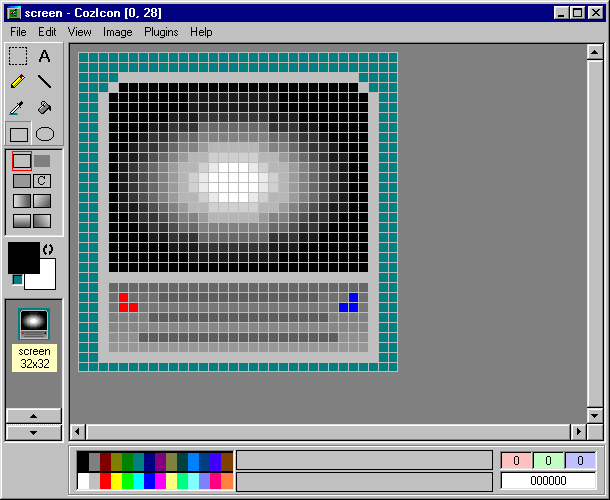



## CozIcon \- True Color Icon Editor

### Description

Supports 16x16 and 32x32 Full Transparency True Color Icons. Has most of the basic image editor type settings: pen, fill, eclipse, rect, text, selections, etc.

But also includes gradient rectangles and gradient eclipses. Also has mild support for custom brushes and my own type of plugins.

Drag and Drop is supported as well is bmp, gif or jpeg to icon conversion. Can also load language packs for our non-english reading friends.

Included is the Main Project, some sample Plugins Projects, some custom brush files, a read me file about custom brushes and a read me concerning the language packs(with two example packs: one for english and the other for spanish).

Some subsets of the Main Project include dynamically loading custom language packs, winconnect(a custom activex for communication through different windows) and hard coding icons (not using savepicture via Visual Basic).

**Fixed**
 
### More Info
 

             |
---                |---
**Submitted On**   |2005-03-01 18:52:20
**By**             |[DoWnLoHo](https://github.com/Planet-Source-Code/PSCIndex/blob/master/ByAuthor/downloho.md)
**Level**          |Intermediate
**User Rating**    |5.0 (110 globes from 22 users)
**Compatibility**  |VB 6\.0
**Category**       |[Complete Applications](https://github.com/Planet-Source-Code/PSCIndex/blob/master/ByCategory/complete-applications__1-27.md)
**World**          |[Visual Basic](https://github.com/Planet-Source-Code/PSCIndex/blob/master/ByWorld/visual-basic.md)
**Archive File**   |[CozIcon\_\-\_185949312005\.zip](https://github.com/Planet-Source-Code/downloho-cozicon-true-color-icon-editor__1-59233/archive/master.zip)

